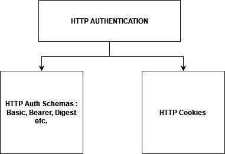

**NOTE :**
 - There are 3 Main People/Group of people/Org responsible of modern day web dev : 
    - **Tim berner lee** : URl, WWW, HTTP, HTML 
    - **Lou Matriouli** : Cookies 
    - **CERN/NCSA/Ari Luotonen/Robert Mccool** : http web server, CGI/REST API
---
**About HTTP :** 
 
 - Based on Client Server (Req-Res) Model
 - Mostly uses Reliable/TCP-IP Connection over port 80 (HTTP3/QUIC uses UDP)
 - Stateless But not Sessionless : HTTP Cookies provide session Mechanism/Stateful sessions.
 - Proxies/Middleware (B/W Client & Server) : Cache, Filter, Log, Load balance, Auth./Cookies, CORS, Tunnel, etc.
 - API - XMLHttpRequest, server-sent events etc.
 - Cache - private, Shared (Proxy, Managed)
 - Status Code : 1xx - Info | 2xx - Success | 3xx - Redirect | 4xx - Client Error | 5xx - Server Error
 - Authorization ~ Request Header (Client) <=> Authentication ~ Response Header (Server)
 - HTTP Auth (General Syntax) : 
   - **Authentication** - WWW-Authenticate/Proxy-Auth: <type/Auth-Scheme> realm/charset/token68/etc.
   - **Authorization** - Authorization/Proxy-Auth : \<type> \<creds>
---
**HTTP Authentication :**
- **HTTP Auth Schema/Methods** : 
  - **Basic Schema (Insecure/Used with HTTPS)**
    - Resource/ww-Authe OR Proxy Authe. : Basic realm="Access 2 site", charset="UTF-8" (Server res./HTTP header)
    - Autho/Proxy-Autho : Basic \<UTF-8 Base64 Encoded key> (Client req/HTTP header)
   - **Bearer Schema** : Used to send info back from client <-> server in http header
     - Resource/WWW-Authe OR Proxy Authe. : Basic realm="Access 2 site", charset="UTF-8" (Server res./HTTP header)
     - Autho/Proxy-Autho : Bearer <Encrypted key> (Client req/HTTP header)
   - **Other Schemas** : Digest, HOBA, Mutual, Negotiate/NTLM, VAPID, SCRAM, AWS4-HMAC-SHA256 etc.
 - **HTTP Cookies** : Stateful/Storage/etc.
   - HTTP Header : **Set-Cookie** (creates a session/link req. with state of server thus making http stateful)
   - Disadvantage (Cons) : Server needs to store sessionID for every user which increase overhead on server, hence other Auth mechanisms like JWT, Oauth etc. used for Auth purpose. Also it's vunerable to CSRF Attack, has size limitation, less scalable depending upon the implementation.
   - Algorithm (General) : SID is also a cookie (session cookie).
     - Server creates session/SID & stores in DB (After Creds Verified) & Sentback cookie+sessionID (i.e 2 cookies)
     - Cookie(user/pass) + SID (session cookie) stored in browser.
     - For every next req. SID is verified/hashed against DB.
     - For logout/session expiry - delete cookie+SID from client (By setting time as backdate) & SID from DB (backend). 
---
**HTTP Auth (Basic) Vs. Other Auth Mechanism (Cookies/SessionID) :**
In basic Auth there is no way to Revoke/logout user & is also insecure. Hence, other Auth mechanisms like cookie based, Session/Token/JWT based approach is used where server after authentication. 
General flow is like server sets a cookie, sessionID at client side using which it makes connection stateful and delete cookie or session at time of revoking.

---
